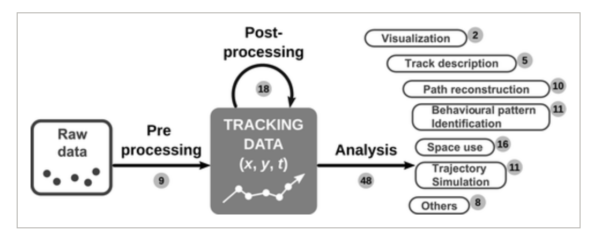

# Introduction {#intro}


Spatial data is most often represented by one of two data models, vector or raster.[^1]

[^1]: [Cran Spatial](https://cran.r-project.org/web/views/Spatial.html)

In geostatistical models, sampled data are interpreted as the result of a random process.[^1]

[^1]: https://en.wikipedia.org/wiki/Kriging


Spatial modeling is an important instrument to guide decision-making dealing with risk-management in different areas, such as public health, econometric, general ecology, as well as public transportation and real-estate.

The development of spatial models and modeling techniques evolved along the times allowing for workflows implementation of geospatial analysis.[^x]

[^x]: [Geospatial Analysis and Model Building](https://gistbok.ucgis.org/bok-topics/geospatial-analysis-and-model-building)

An important distinction has to be made between **spatial model** and **spatial data model**. 

While *data models* are important connections between the individual perception of certain events and how those events are being represented and processed with an algorithm as spatial primitives and relationships.

*Spatial models* are defined as *process models*. Dynamic spatial processes are phenomena that change in time, such as a virus spread, flood formation, and land cover change. 

A heuristic explanation of how point distances are calculated is to considered whether the Eulerian or the Lagrangian views are the most suitable ones.

> Eulerian models concern about the change of properties (e.g. temperature, land cover) at fixed locations, while Lagrangian models tracks the movement of objects in space. 


---


As said, one more important distinction is that geographic information systems (GISs) are composed of raster and vector data.[^1]

[^1]: [Spatial data models](https://planet.uwc.ac.za/nisl/gis/web_page/page_15.htm)


```{r intro-1, echo=FALSE,fig.align='center', fig.cap="Credits:[Spatial data models](https://planet.uwc.ac.za/nisl/gis/web_page/page_15.htm)"}
knitr::include_graphics("images/layers.jpg")
```


In this workshop only vector data will be examined to provide insight into geographic variations in distribution of data (such as species, frogs in Oregon and/or diseases risk spread).[^1]

> In vector data models space is not quantized into discrete grid cells like the raster model, but use points and associated X, Y coordinate pairs to represent the vertices of spatial feature.

[^1]: [Vector data models](https://saylordotorg.github.io/text_essentials-of-geographic-information-systems/s08-data-models-for-gis.html)

In particular, will be examined location clustering and disease clustering.

We will be looking at two case studies:

- Oregon frogs habitat locations
- Cancer expected development in a particular location


Spatial models allows for spatial autocorrelation. In general modeling, multicollinearity, or correlation among predictors in the model is used to make predictor selection. In case of spatial modeling, predictors such as longitude and latitude are evidence of important underlying spatial processes at work; an integral component of the data. [^1]

[^1]: https://pro.arcgis.com/en/pro-app/latest/tool-reference/spatial-statistics/regression-analysis-basics.htm

Spatial data is considered typically autocorrelated and/or clustered.[^1] A simple explanation is concerning with the independence of correlated clusters with the changing data-information in the spatial cluster.

[^1]: [developing a cancer atlas](https://atlas.cancer.org.au/developing-a-cancer-atlas/Chapter_4.html)

Hence, data may be spatially correlated and observations in neighboring areas may be more similar than observations in areas that are farther away.[^1]

[^1]: [Geospatial Health Data: Modeling and Visualization with R-INLA and Shiny](https://www.paulamoraga.com/book-geospatial/sec-arealdatatheory.html)

The analysis of the residual spatial autocorrelation and the prediction of continuous spatial process is called **Kriging**(geo interpolation named after Danie Kringe (South Africa)) (also known as *Wiener–Kolmogorov* prediction / distance-weighted average).[^1]

[^1]: Drew CA, Wiersma Y, Huettmann F. Predictive species and habitat modelling in landscape ecology: concepts and applications. 1st ed. New York: Springer; 2010. And Cressie 1993. And https://en.wikipedia.org/wiki/Kriging


A spatial model is a representation of various social and natural processes:

- land cover change
- spread of invasive species
- population migration

So, to be more explicit, spatial modeling combines spatial analysis and predictions. 

```{r intro-2, echo=FALSE, fig.align='center',fig.cap="Credits:https://besjournals.onlinelibrary.wiley.com/doi/10.1111/1365-2656.13116"}

```


**Krinking** is even the term that defines the best model performance, and so, the best prediction. This term is considered as synonym of *prediction* in classical data forecasting model techniques.

---

The integration of **GIS** and **Multicriteria Decision-Making Analysis (MCDA)** is key in providing help to decision makers in different areas. 

GIS-based MCDA use a linear weighted equation to combine the spatial variables.[^1]

[^1]: [geospatial analysis and model building](https://gistbok.ucgis.org/bok-topics/geospatial-analysis-and-model-building)

$$y=\sum_{i=1}^n{w_if(x_i)}$$ 


Where $W$ defines a spatial neighborhood structure over the entire study region, and its elements can be viewed as weights.

Under this structure, the total number of neighbors in each area is adjusted to obtain a standardized matrix:

$$w_\text{std(i,j)}=\frac{w_{ij}}{\sum_{j=1}^{n}{w_{ij}}}$$


Model types:

- LR linear regression
- multivariate logistic regression modeling of weights ($w_i$) (animal habitat)
- discriminant analysis (community resilience to environmental disasters)
- support vector machine (SVM)
- decision-trees 
- genetic algorithm (GA)
- artificial neural network (ANN) or deep neural network (DNN)

---

Model adjustment 

Base spatial models are adjusted to data-type based on the type of phenomenon that is investigated. As an example, a virus spread would be best represented with a Poisson distribution, of which a log transformation can be applied.

A list of the *tools* for making models adjustment is to decide whether to use:

- CAR
- Poisson or spatial effect of the log of the Poisson
- Markov chain Monte Carlo (MCMC)
- spatial cross validation resampling
- deterministic or Bayesian model (Integrated nested Laplace approximation (INLA) is a computational less-intensive alternative to MCMC designed to perform approximate Bayesian inference in latent Gaussian models)

---

There are a number of spatial models that can be used, but my favorite is Kriging. While other methods such as Geographically Weighted Regression (GWR) or Inverse Distance Weighting (IDW)[^1]

[^1]: [article towardsdatascience](https://towardsdatascience.com/building-kriging-models-in-r-b94d7c9750d8#:~:text=R%20Code%20for%20Data%20Prep%3A&text=The%20idea%20behind%20kriging%20is,which%20saves%20time%20and%20money.)

Finally, **validation** is an important step in *spatial modeling work*. A model can be validated by testing its prediction in another dataset or study area that is different from the dataset or study area where the model was trained, allowing for spatial correlation and spatially correlated risk factors.[^1]

[^1]: [r-project article](https://journal.r-project.org/archive/2018/RJ-2018-036/RJ-2018-036.pdf)


---
