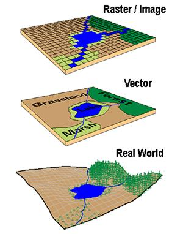
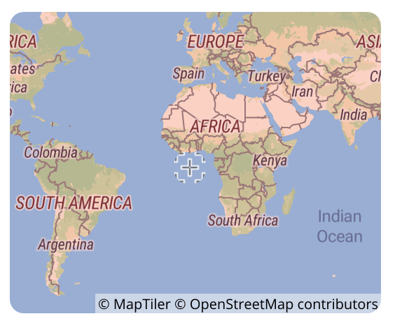

--- 
title: "Spatial model with R"
author: "Federica Gazzelloni"
date: "2022 September 19"
site: bookdown::bookdown_site
output: bookdown::gitbook
documentclass: book
#bibliography: [book.bib, packages.bib]
biblio-style: apalike
link-citations: yes
github-repo: fgazzelloni/How-to-Spatial-Modeling-with-R
description: "This is an ice breaking activity to spatial model with R."
# cover-image: "images/cover.png"
---

# Prerequisites


This ice-breaking activity to spatial modeling with R includes two case studies:

- Oregon spotted frog habitat study
- A type of cancer spread in Scotland


It is required a good manner of RStudio and a little practice in making plots with {ggplot2}. 

To set up install the following packages:

```{r setup, include=F,	message = FALSE,warning = FALSE}

knitr::opts_chunk$set(
  include=TRUE,
	#eval = FALSE,
	fig.align = "center",
  message=FALSE, 
  warning=FALSE, 
  paged.print=FALSE,
	comment = ""
)
```


If these packages are missing in your RStudio they would need to be installed.

Please choose between {OpenStreetMap} and {ggmap}, {OpenStreetMap} has some extra Java requirement and it is not always available for the most updated versions of Mac.

```{r install, eval=FALSE, include=TRUE}
my_packages <- c("tidyverse","ggthemes",
                 "maptools","OpenStreetMap","ggmap",
                 "spdep","sf","spocc",
                 "dismo","SpatialEpi")

install.packages(my_packages, repos = "http://cran.rstudio.com")

install.packages("remotes")
remotes::install_github("fgazzelloni/oregonfrogs")
```

The GitHub repository for this workshop is here: https://github.com/Fgazzelloni/How-to-Spatial-Modeling-with-R

Once installed the packages go to the GitHub repo above, You can fork the repository onto your RStudio, or copy and paste the code directly. Another option is to use {usethis} and some of its handling functions, for open the project in your machine.

Once set go to the `/data` folder and load the RData in the environment. It will make things easier as you don't need to run some chucks of code which will require some time to compute, and for this reason are set to `eval = FALSE`.

For any questions please email: docksbox@pm.me


<!--chapter:end:index.Rmd-->

# Introduction {#intro}


Spatial data is most often represented by one of two data models, vector or raster.[^1]

[^1]: [Cran Spatial](https://cran.r-project.org/web/views/Spatial.html)

In geostatistical models, sampled data are interpreted as the result of a random process.[^2]

[^2]: https://en.wikipedia.org/wiki/Kriging


Spatial modeling is an important instrument to guide decision-making dealing with risk-management in different areas, such as public health, econometric, general ecology, as well as public transportation and real-estate.

The development of spatial models and modeling techniques evolved along the times allowing for workflows implementation of geospatial analysis.[^3]

[^3]: [Geospatial Analysis and Model Building](https://gistbok.ucgis.org/bok-topics/geospatial-analysis-and-model-building)

An important distinction has to be made between **spatial model** and **spatial data model**. 

While *data models* are important connections between the individual perception of certain events and how those events are being represented and processed with an algorithm as spatial primitives and relationships.

*Spatial models* are defined as *process models*. Dynamic spatial processes are phenomena that change in time, such as a virus spread, flood formation, and land cover change. 

A heuristic explanation of how point distances are calculated is to considered whether the Eulerian or the Lagrangian views are the most suitable ones.

> Eulerian models concern about the change of properties (e.g. temperature, land cover) at fixed locations, while Lagrangian models tracks the movement of objects in space. 


---


As said, one more important distinction is that geographic information systems (GISs) are composed of raster and vector data.[^4]

[^4]: [Spatial data models](https://planet.uwc.ac.za/nisl/gis/web_page/page_15.htm)


```{r intro-1, echo=FALSE,fig.align='center', fig.cap="Credits:[Spatial data models](https://planet.uwc.ac.za/nisl/gis/web_page/page_15.htm)"}

```


In this workshop only vector data will be examined to provide insight into geographic variations in distribution of data (such as species, frogs in Oregon and/or diseases risk spread).[^5]

> In vector data models space is not quantized into discrete grid cells like the raster model, but use points and associated X, Y coordinate pairs to represent the vertices of spatial feature.

[^5]: [Vector data models](https://saylordotorg.github.io/text_essentials-of-geographic-information-systems/s08-data-models-for-gis.html)

In particular, will be examined location clustering and disease clustering.

We will be looking at two case studies:

- Oregon frogs habitat locations
- Cancer expected development in a particular location


Spatial models allows for spatial autocorrelation. In general modeling, multicollinearity, or correlation among predictors in the model is used to make predictor selection. In case of spatial modeling, predictors such as longitude and latitude are evidence of important underlying spatial processes at work; an integral component of the data. [^6]

[^6]: https://pro.arcgis.com/en/pro-app/latest/tool-reference/spatial-statistics/regression-analysis-basics.htm

Spatial data is considered typically autocorrelated and/or clustered.[^7] A simple explanation is concerning with the independence of correlated clusters with the changing data-information in the spatial cluster.

[^7]: [developing a cancer atlas](https://atlas.cancer.org.au/developing-a-cancer-atlas/Chapter_4.html)

Hence, data may be spatially correlated and observations in neighboring areas may be more similar than observations in areas that are farther away.[^8]

[^8]: [Geospatial Health Data: Modeling and Visualization with R-INLA and Shiny](https://www.paulamoraga.com/book-geospatial/sec-arealdatatheory.html)

The analysis of the residual spatial autocorrelation and the prediction of continuous spatial process is called **Kriging**(geo interpolation named after Danie Kringe (South Africa)) (also known as *Wiener–Kolmogorov* prediction / distance-weighted average).[^9]

[^9]: Drew CA, Wiersma Y, Huettmann F. Predictive species and habitat modelling in landscape ecology: concepts and applications. 1st ed. New York: Springer; 2010. And Cressie 1993. And https://en.wikipedia.org/wiki/Kriging


A spatial model is a representation of various social and natural processes:

- land cover change
- spread of invasive species
- population migration

So, to be more explicit, spatial modeling combines spatial analysis and predictions. 

```{r intro-2, echo=FALSE, fig.align='center',fig.cap="Credits:https://besjournals.onlinelibrary.wiley.com/doi/10.1111/1365-2656.13116"}
knitr::include_graphics("images/framework.png")
```


**Krinking** is even the term that defines the best model performance, and so, the best prediction. This term is considered as synonym of *prediction* in classical data forecasting model techniques.

---

The integration of **GIS** and **Multicriteria Decision-Making Analysis (MCDA)** is key in providing help to decision makers in different areas. 

GIS-based MCDA use a linear weighted equation to combine the spatial variables.[^10]

[^10]: [geospatial analysis and model building](https://gistbok.ucgis.org/bok-topics/geospatial-analysis-and-model-building)

$$y=\sum_{i=1}^n{w_if(x_i)}$$ 


Where $W$ defines a spatial neighborhood structure over the entire study region, and its elements can be viewed as weights.

Under this structure, the total number of neighbors in each area is adjusted to obtain a standardized matrix:

$$w_\text{std(i,j)}=\frac{w_{ij}}{\sum_{j=1}^{n}{w_{ij}}}$$


Model types:

- LR linear regression
- multivariate logistic regression modeling of weights ($w_i$) (animal habitat)
- discriminant analysis (community resilience to environmental disasters)
- support vector machine (SVM)
- decision-trees 
- genetic algorithm (GA)
- artificial neural network (ANN) or deep neural network (DNN)

---

Model adjustment 

Base spatial models are adjusted to data-type based on the type of phenomenon that is investigated. As an example, a virus spread would be best represented with a Poisson distribution, of which a log transformation can be applied.

A list of the *tools* for making models adjustment is to decide whether to use:

- CAR
- Poisson or spatial effect of the log of the Poisson
- Markov chain Monte Carlo (MCMC)
- spatial cross validation resampling
- deterministic or Bayesian model (Integrated nested Laplace approximation (INLA) is a computational less-intensive alternative to MCMC designed to perform approximate Bayesian inference in latent Gaussian models)

---

There are a number of spatial models that can be used, for Spatial and Spatio-Temporal Modelling, Prediction and Simulation. One is Kriging, while other methods are the Geographically Weighted Regression (GWR) or Inverse Distance Weighting (IDW)[^11]

[^11]: [article towardsdatascience](https://towardsdatascience.com/building-kriging-models-in-r-b94d7c9750d8#:~:text=R%20Code%20for%20Data%20Prep%3A&text=The%20idea%20behind%20kriging%20is,which%20saves%20time%20and%20money.)

One example can be found in the {gstat} package, which provide the `kringe()` function.[^12]

[^12]: [gstat](https://cran.r-project.org/web/packages/gstat/gstat.pdf)


Finally, **validation** is an important step in *spatial modeling work*. A model can be validated by testing its prediction in another dataset or study area that is different from the dataset or study area where the model was trained, allowing for spatial correlation and spatially correlated risk factors.[^13]

[^13]: [r-project article](https://journal.r-project.org/archive/2018/RJ-2018-036/RJ-2018-036.pdf)


---

<!--chapter:end:01-intro.Rmd-->

# Case study: Rana Pretiosa


The first case study is about animal ecology, we will be looking at a frog particular specie **Rana Pretiosa**, scientific name **Rana pretiosa Baird & Girard, 1853**, and use some interesting data from Oregon as well as downloading more data from **GBIF | Global Biodiversity Information Facility**.

The scope is to visualize the presence of these nice little frogs across different location with making a map using {ggplot2} by Hadley Wickham.

### Get started making a map!

The first map that we make is a general frog location map of the United States. In this case we need the {spocc} package by Hannah Owens and Vijay Barve and Scott Chamberlain, to load the data from GBIF and make the map.

```{r ch2-01-1, eval=TRUE, message=FALSE, warning=FALSE, paged.print=FALSE}
library(tidyverse)
library(oregonfrogs)
library(spocc)
```

```{r ch2-01-2}
load("data/case_study_1.RData")
```

```{r ch2-01-3,eval=FALSE,cache=TRUE}
do_gbif <- occ("Rana pretiosa Baird & Girard, 1853",
               from = "gbif",
               limit = 1000,
               has_coords = TRUE
               )

do_gbif1 <- data.frame(do_gbif$gbif$data)
```


```{r ch2-01-3-4}
do_gbif2 <- do_gbif1%>%
  rename(longitude=Rana_pretiosa_Baird_._Girard._1853.longitude,
         latitude=Rana_pretiosa_Baird_._Girard._1853.latitude)
```


```{r ch2-01-5, message=FALSE, warning=FALSE, paged.print=FALSE}
states<- map_data("state")
oregon <- states %>% filter(region=="oregon")

ggplot(data = states, mapping = aes(long,lat,group=region))+
  geom_polygon(color="grey",fill=NA) +
  geom_polygon(data = oregon, 
               inherit.aes = TRUE, 
               color="pink",fill="pink") +
  geom_point(data = do_gbif2,
             mapping = aes(x=longitude, y=latitude),
             inherit.aes = FALSE, 
             alpha=0.5,size=0.5)+
  coord_quickmap() +
  theme_bw()
```


Once visualized, we will be making some assumptions about their movement and habitat use based on the results of a study by Dr. Michael J Adams from the Forest and Rangeland Ecosystem Science Center in Oregon.

More information about this study can be found here: https://doi.org/10.1670/20-060


The dataset has been released for #TidyTuesday 2022 week 31 and can be downloaded here: https://github.com/rfordatascience/tidytuesday/tree/master/data/2022/2022-08-02

Or, you can install the package from github: https://github.com/Fgazzelloni/oregonfrogs

```{r ch2-02,echo=FALSE,out.width="30%",fig.align='center',fig.cap="Credits: oregonfrogs package"}
knitr::include_graphics("images/oregonfrogs.png")
```

```{r ch2-03,eval=FALSE, message=FALSE, warning=FALSE, include=T, paged.print=FALSE}
# install.packages("remotes")
remotes::install_github("fgazzelloni/oregonfrogs")
```


One of the most important step of spatial modeling, and modeling in general, is to have a good knowledge of the argument. So, the more we know about **Rana Pretiosa** the better!

Let's hear **Rana Pretiosa** sound: https://amphibiaweb.org/species/5131

More information about Rana pretiosa can be found here:

- [GBIF](https://www.gbif.org/species/2426776)

In particular, we will be looking at the location where **rana pretiosa** has been located with the use of radio telemetry frequencies in the **Crane Prairie Reservoir**, which is a man-made lake located about 42 miles (68 km) southwest of Bend in Deschutes County, Oregon, United States.[^14]

[^14]: [Crane Prairie Reservoir](https://en.wikipedia.org/wiki/Crane_Prairie_Reservoir)

An interesting map of the lake with related data can be found here: [Lake and Reservoir in Deschutes County in Oregon map data](https://data.deschutes.org/datasets/deschutes::lakes-and-reservoirs-1/explore)


We will require more packages while performing our analysis. 

```{r ch2-04, message=FALSE, warning=FALSE, paged.print=FALSE}
library(oregonfrogs)  
```

Let's have a look at the data, we have 311 observations and 16 variables which include the habitat type, the date, the radio frequency, and other variables such as gender, type of water, presence of beavers, and if they are captured, located or just visualized.

So, many interesting hypothesis can be done about their movements habitat use.

```{r ch2-05, comment=""}
oregonfrogs%>%head(3)
```


One more interesting information is about the location, in this case a **UTM distance** (from the Equator or from the North) is provided, and this type of localization is the most suitable for animal location. 

The **Universal Transverse Mercator (UTM)** is a common projection is  which preserves local angles and shapes, and divides the Earth into 60 zones of 6 degrees of longitude in width. Each of the zones uses a transverse Mercator projection that maps a region of large north-south extent. [^15]

[^15]: [Geospatial Health Data: Modeling and Visualization with R-INLA and Shiny](https://www.paulamoraga.com/book-geospatial/sec-spatialdataandCRS.html)

Interesting is that it is expressed in meters, so it gives more opportunity in case one wants to consider the distance. For now, we transform these UTM projections into **longitude** and **latitude**. For doing this we need the {sf} package by Edzer Pebesma.

Many are the GIS packages available in R to use, and sometime is difficult to make a choice as they are all very useful and interesting. 

To transform the UTM values into long and lat we use the `sf::st_as_sf()` function with some arguments which are compulsory for what we do.

We need to specify where the coordinates are located in our set, and set a **CRS** or coordinate reference system information. 


```{r ch2-06, comment=""}
# Build a tibble with the geo-location information
frogs_coord <- oregonfrogs %>%
  dplyr::select(UTME_83, UTMN_83)

# Tranform it to lat and long
frogs_coord <- 
  frogs_coord %>% 
  # transform to simple features as geometry
  sf::st_as_sf(coords = c(1,2), 
               crs = "+proj=utm +zone=10") %>%
  # utm tranformation to longlat
  sf::st_transform(crs = "+proj=longlat +datum=WGS84")  %>%
  tibble()

frogs_coord%>%head(3)
```

As you can see the first projection points to *utm* as the type of data provided and set the zone 10. While the second transformation applies to longlat types projection on WGS84, (World Geodetic System 1984, known as EPSG:4326), which express the degree of longitude and latitude starting from a particular point of view, in this case EPSG:4326.


```{r ch2-07,echo=FALSE,fig.dim="50%",fig.align='center',fig.cap="Credits: https://epsg.io/4326"}

```

All the available CRS in R can be seen by typing `View(rgdal::make_EPSG())` [^16]

[^16]: [book geospatial](https://www.paulamoraga.com/book-geospatial/sec-spatialdataandCRS.html)


```{r ch2-08,comment=""}
library(purrr)
frogs_location <- tibble(Detection = oregonfrogs$Detection,
                         Subsite = oregonfrogs$Subsite,
                         Frequency = oregonfrogs$Frequency,
                         lat = unlist(map(frogs_coord$geometry, 2)),
                         long = unlist(map(frogs_coord$geometry, 1)))

frogs_location%>%head(3)
```


## Look at oregonfrogs data

Let's have a first sight at the data based on location. The first thing to notice is that points (frogs) are aligned following some sort of linearity. But, what is the difference from other data, is that now these points are following an environment. Let's have a look at it.

```{r ch2-09, message=FALSE, warning=FALSE, paged.print=FALSE}
ggplot(data = frogs_location, aes(x=long,y=lat))+
  geom_point() +
  geom_smooth(method = "loess") +
  theme_bw()
```


### Let's map the lake! 

How do we set the map for the location of our **Rana Pretiosa** in the Crane Prairie Reservoir?

In the study page we can find the **BOX**, the box is the four corner reference points, bounding our interested area. 

Bounding Box: https://www.sciencebase.gov/catalog/item/imap/60ba5a00d34e86b9388d86bc

Bounding Box[-121.824775, 43.764375, -121.764923, 43.814821]

The area can be retrieved with {OpenStreetMap} package by : Ian Fellows and visualized with a nice resolution with the `plot.OpenStreetMap()` or simply the `plot()` function. The {OpenStreetMap} doesn't work the same for all systems. You'll might need to use another package, such as {ggmap} which provide the same background map to use with {ggplot2}.

So, don't run this part if you incurr issues with {OpenStreetMap}, jump on the next one.

```{r ch2-09-1, eval=FALSE}
library(OpenStreetMap)
map <- openmap(c(43.764375,-121.824775),c(43.814821,-121.764923))

OpenStreetMap::plot.OpenStreetMap(map)
wider_map <- openproj(map)
base_map <- OpenStreetMap::autoplot.OpenStreetMap(wider_map) + 
  geom_point(data = frogs_location,
             aes(x = long, y = lat), 
             shape=21,stroke=0.2, size =  4,
             color="grey40") +
  xlab("Longitude (°E)") + ylab("Latitude (°S)")
```

```{r ch2-10, echo=FALSE,out.width="50%",fig.cap="Crane Prairie Reservoir"}

```


In this map is made with {ggmap} and {ggplot2} for the frogs locations.


```{r ch2-10-1, message=FALSE, warning=FALSE, paged.print=FALSE}
library(ggmap)
```

```{r ch2-11, eval=FALSE,cache=TRUE}
box=c(43.764375,-121.824775,43.814821,-121.764923)
crane_reservoir <- get_stamenmap(bbox = c(left = -121.824775, 
                                          bottom = 43.764375, 
                                          right = -121.764923, 
                                          top = 43.814821),
                                 zoom = 13, color = c("color"),
                                 maptype = "terrain-background")

```


```{r ch2-11-1}
base_map <- ggmap(crane_reservoir) + 
    geom_point(data = frogs_location,
             aes(x = long, y = lat), 
             shape=21,stroke=0.2, size =  4,
             color="grey40") +
  xlab("Longitude (°E)") + ylab("Latitude (°S)")

base_map
```


## Time as coordinate

With a little modification of the dataset we can visualize the frogs by months. This study has been carried from mid September 2018 to late November of the same year, so three months of observations.

```{r ch2-12, message=FALSE, warning=FALSE, paged.print=FALSE}
frogs_location_tm <- tibble(ReportedDay = oregonfrogs$Ordinal,
                            geometry=frogs_coord$geometry) %>%
  mutate(time = as.Date("2018-01-01") + ReportedDay,
         month=lubridate::month(time))


base_map+
  geom_sf(data = frogs_location_tm,
          aes(col = factor(month), geometry=geometry),
          inherit.aes = F) +
  facet_wrap(~cut(time, "1 months")) + 
  scale_color_discrete(labels=c("September","October","November"))+
  labs(color="Month")+
  theme_void()
```

Some speculation could be done about the reasons why the frogs are not located in some substrates of the lake in September more than in November.  

## Make a grid

Let's create a grid of points around the frogs' locations. In order to do that we need the {sf} package, initially we do the same as before, but now we want a **Simple feature** collection of points and not a tibble with coordinates as before. The functions `sf::st_make_grid()` and `sf::st_as_sfc(sf::st_bbox(points))` with the bbox reference for the points let us create a grid.

```{r ch2-13, message=FALSE, warning=FALSE, paged.print=FALSE}
# make a grid
frogs_coord_freq <- tibble(oregonfrogs$UTME_83, oregonfrogs$UTMN_83,
                      oregonfrogs$Frequency)

points <- sf::st_as_sf(x = frogs_coord_freq, 
                       coords = c(1,2), 
                       crs = "+proj=utm +zone=10") %>%
  sf::st_transform(frogs_coord, 
                   crs = "+proj=longlat +datum=WGS84")  

grid = sf::st_make_grid(
  sf::st_as_sfc(sf::st_bbox(points)),
  what = "centers",
  cellsize = .002, 
  square = F)


ggplot()+
  geom_sf(data=grid,size=0.3)+
  geom_sf(data=points)+
  coord_sf()+
  ggthemes::theme_map()
```

What we do now is to group the frogs by date. 

```{r ch2-14}
oregonfrogs%>%
  mutate(SurveyDate=as.Date(SurveyDate,"%m/%d/%Y"))%>%
  arrange(SurveyDate)%>%
  count(SurveyDate,Ordinal)%>%
  head(3)
```


## Work with Models

Packages functionality from rgeos,raster,rgdal,terra packages are included in {sf},and {dismo} so we don't need to load them.

```{r ch2-14-1, message=FALSE, warning=FALSE, paged.print=FALSE}
library(dismo)  # for modeling
```


Here we use **wrld_simpl** data from {maptools}, to be able to use the `plot()` function faster, you can install the package or load it because data is included in the `/data` folder as `.RData` format. We can load the `data/case_study_1.RData` to load all the data we need for this workshop, this is already been done at the very beginning of this chapter. In case you'd like to do that separately, just type: `load("data/case_study_1.RData")` and all data will be loaded in the global environment
      
      
```{r ch2-15, eval= FALSE}
world <- map_data("world")
gbi_coords<- tibble(x=do_gbif2$longitude,y=do_gbif2$latitude)

ggplot(world)+
  geom_polygon(aes(long,lat,group=group),fill="grey90",color="grey30") +
  geom_polygon(data=states, aes(long,lat,group=group),color="grey40") +
  geom_point(data = gbi_coords, aes(x,y),
             color="pink") +
  coord_sf(xlim=c(-125,-90),ylim=c(35,65))+
  ggthemes::theme_map()
```

This is a raster stack composed of 19 raster layers.

```{r ch2-16, cache=TRUE, eval=FALSE, include=TRUE}
frogs <-data.frame(long=do_gbif2$longitude,lat=do_gbif2$latitude)
climate <- dismo::getData("worldclim",download = T,var="bio",res=2.5)

plot(climate,legend=FALSE)
```

```{r ch2-16-1, echo=FALSE,eval=TRUE}
knitr::include_graphics("images/climate_plot.png")
```


```{r ch2-16-2, eval=FALSE, include=TRUE}
frog_climate <- extract(climate,frogs)
```


```{r ch2-16-3}
frog_climate %>% head(3)
```

Apply the **Bioclim algorithm** used for species distribution modeling, the classic **climate-envelope-model**. It computes the similarity of a location by comparing the values of environmental variables at any location to a percentile distribution of the values at known locations of occurrence. More info here: `?dismo::bioclim`

We use the `pairs(x, v=NULL, pa='pa', hist=TRUE, cor=TRUE)` function to plot the results of the model, with options from the {dismo} package.

```{r ch2-17, eval=FALSE}
require(dismo)
bioclim.mod <- dismo::bioclim(frog_climate)
```


```{r ch2-17-1, eval=FALSE,include=TRUE}
pairs(bioclim.mod,pa="pa")
```

```{r ch2-17-2, echo=FALSE,eval=TRUE}
knitr::include_graphics("images/pairs_bioclim.png")
```


Now, let's build a stack with the `stack()` function, including all the bioclimatic layers from the original raster stack. 

```{r ch2-18,eval=FALSE, include=TRUE}
doParallel::registerDoParallel()
predictors <- stack(climate$bio1,climate$bio2,climate$bio3,
                    climate$bio4,climate$bio5,
                    climate$bio6,climate$bio7,climate$bio8,
                    climate$bio9,climate$bio10,climate$bio11,
                    climate$bio12,climate$bio13,climate$bio14,
                    climate$bio15,climate$bio16,climate$bio17,
                    climate$bio18,climate$bio19)
predictions <- predict(predictors,bioclim.mod)
```

```{r ch2-18-1,eval=TRUE, include=FALSE}
predictions
```


```{r ch2-18-2,eval=FALSE, include=TRUE}
plot(predictions,xlim=c(-125,-100),ylim=c(35,55),axes=T)
```


```{r ch2-19, echo=FALSE}
knitr::include_graphics("images/frogs_location_raster.png")
```


```{r ch2-20, eval=FALSE,echo=FALSE}
save.image("data/case_study_1.RData")
```

---


<!--chapter:end:02-case_study_1.Rmd-->

# Case study 2: Disease mapping

The aim of disease mapping is to provide a representation of the spatial distribution of the risk of a disease in the study area, which we assume is divided into several non-overlapping smaller regions. The risk may reflect actual deaths due to the disease (mortality) or, if it is not fatal, the number of people who suffer from the disease (morbidity) in a certain period of time for the population at risk. [^17]

[^17]: [Applied Spatial Data Analysis with R](https://link.springer.com/book/10.1007/978-1-4614-7618-4)

A simple measure of disease risk in areas is the standardized incidence ratio (SIR). [^18]

[^18]: [areal data theory](https://www.paulamoraga.com/book-geospatial/sec-arealdatatheory.html)

<!--chapter:end:03-case_study_2.Rmd-->

# Conclusion

This is the end of our tutorial on how to spatial modeling with R. 

The most interesting part of this overall introduction is how to manage different packages dealing with both raster and vector data. 
We now know how to deal with different type of data for making a map, and are aware of the model adjustments that are required for making a spatial model. Important to mention are the weights and the distances, these two factors are very important for influencing the results of a model predictor.

Good luck with your maps! I look forward to seeing your future Twitter posts for the next #30DayMapChallenge edition 2022.


<!--chapter:end:04-conclusion.Rmd-->

# References

   
Where to start: https://rspatial.org/

Overview by Cran on Spatials: https://cran.r-project.org/web/views/Spatial.html

A list of packages: https://github.com/cran-task-views/Spatial/blob/main/Spatial.md

Carpenteries: https://datacarpentry.org/lessons/#geospatial-curriculum

Books to start:

- [Geocomputation with R](https://geocompr.robinlovelace.net/index.html)
- [Applied Spatial Data Analysis with R](https://link.springer.com/book/10.1007/978-1-4614-7618-4)


Other references:

- [Spatial Data Science](https://keen-swartz-3146c4.netlify.app/)
- [Introduction to Spatial Data Programming with R](http://132.72.155.230:3838/r/index.html)

usethis: 
- [An Introduction to R for Spatial Analysis and Mapping](https://www.spatialanalysisonline.com/An%20Introduction%20to%20Spatial%20Data%20Analysis%20in%20R.pdf)
- [Consumer Data Research Center](https://data.cdrc.ac.uk/dataset/introduction-spatial-data-analysis-and-visualisation-r)

Extra: 

- [A free introduction to geo](https://mapschool.io/)


<!--chapter:end:05-references.Rmd-->

