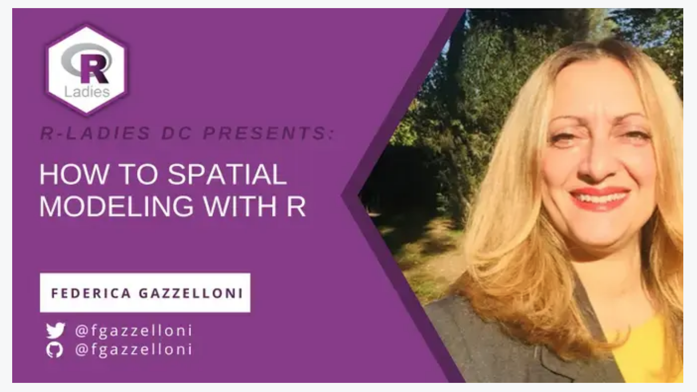

How to Spatial Modeling with R


This is meant for people new to spatial analysis and modeling with RStudio but comfortable in making simple data visualization with ggplot2.


The workshop took place on Wednesday 21st of September 2022 at 6pm EDT (10pm UTC).

To follow along you would need to install these packages:
```{r}
my_packages <- c("tidyverse","ggthemes",
                 "maptools","OpenStreetMap","ggmap",
                 "spdep","sf","spocc",
                 "dismo","SpatialEpi")

install.packages(my_packages, repos = "http://cran.rstudio.com")

install.packages("remotes")
remotes::install_github("fgazzelloni/oregonfrogs")
```


Full video here:
[](https://youtu.be/oYRnA-8ncPU)

Presentation: [presentation of the tutorial in pdf format](presentation.pdf)


